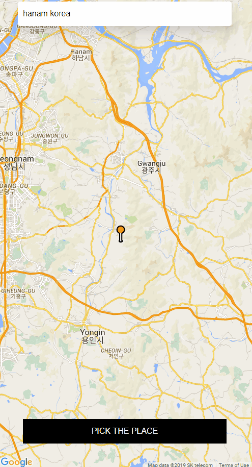

# HUFS(한국외대) HUFS-CAR-client😀
TypeScript, React, GraphQL, Apollo 사용한 카풀 시스템 
- 교환학생들의 접근성을 위해 영어 사용
- 핸드폰, FACEBOOK 인증을 통한 간편한 로그인(학생정보로 로그인 추가 예정)

### HOME
 
### SETTING
 
### ADD PLACE
 
### ChangeDriving Mode
 
### Driving Request
 
### Driving Accept
